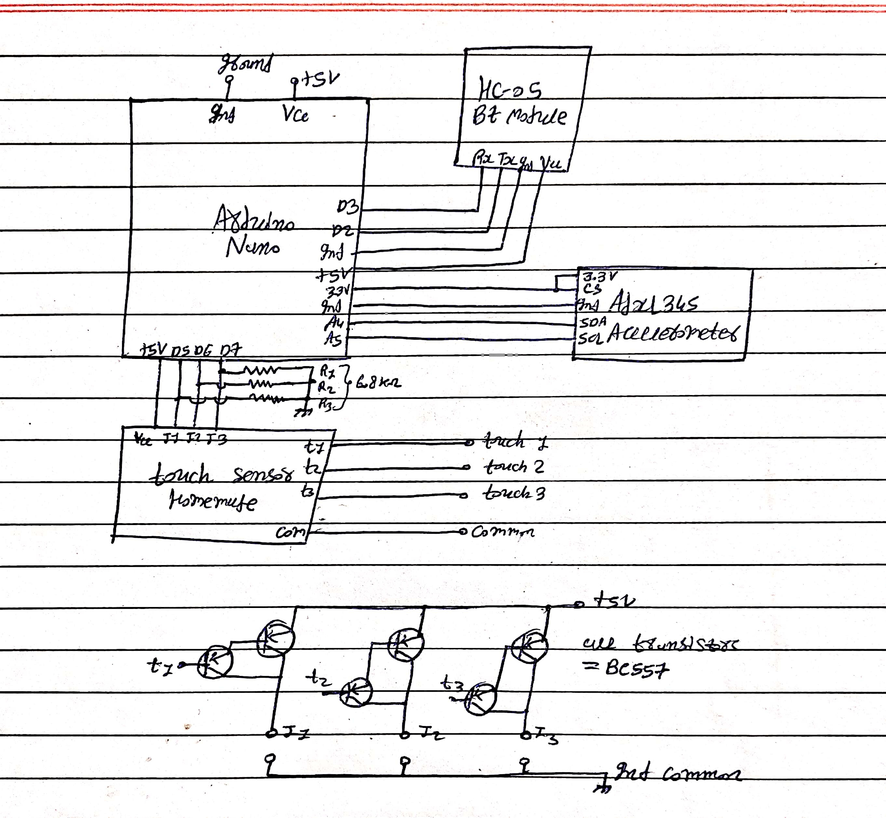

# ✨ GCM-n0 (Gesture Control Mouse - Wireless)

   

> Control your computer mouse with just your **hand gestures** — no wires, no limits!

---

## 📦 Components Used

- 🔹 **ADXL345** (Digital Accelerometer)
- 🔹 **HC-05** Bluetooth Module
- 🔹 **Homemade Touch Sensor**
- 🔹 **Arduino Uno** (or compatible board)

---

## ⚡ How It Works

The project allows controlling the cursor and clicks using simple finger gestures:

- **Cursor Movement (Up, Down, Left, Right):**
  - Attach **T1** and **T2** touch sensors on the **first** and **second** fingers (after applying insulation tape).
  - When **first** and **second fingers** are **joined together**, **cursor movement** is activated.
  - Removing the joint **stops** cursor movement.

- **Mouse Clicks:**
  - Attach **T3** touch sensor on the **mid of the second finger**.
  - When **cursor movement is off**:
    - **First finger touching thumb** → **Left Click**
    - **Second finger touching thumb** → **Right Click**

> **Note**: The **common wire** of the touch sensor must be connected to your **body**.

---

## 🛠️ Setup Instructions

### 🔧 Arduino Setup
- Install **Adafruit ADXL345 Sensor** library:
  - Arduino IDE → Library Manager → Search "**Adafruit ADXL345**" → Install.

- Upload the provided `GCM-n0.ino` code to your Arduino board.

### 💻 Python Setup
- Install required Python libraries:
```bash
pip install pynput pyserial
```
(time module is built into Python by default.)

Run the GCM-n0.py script after Bluetooth connection.


---

🖥️ How to Use

1. Power on your Arduino + HC-05 module.


2. Pair HC-05 with your computer via Bluetooth.


3. Run the Python script GCM-n0.py.


4. Use gestures:

➡️ Join first and second fingers → Move cursor

✋ Unjoin fingers → Stop cursor

☝️ Thumb + First finger → Left Click

✌️ Thumb + Second finger → Right Click


---

📸 Project Images

**Circuit Diagram:**



---

📁 Project Structure

GCM-n0/
├── GCM-n0.ino       # Arduino Code (Accelerometer + Touch Sensors)
├── GCM-n0.py        # Python Script (Mouse Control)
├── Images/          # Project Images
└── README.md        # Documentation


---

🙌 Credits

Developed with ❤️ by mikey-7x.

Special thanks to the open-source community for providing awesome libraries!


---

📝 License

MIT License

Copyright (c) 2024 mikey-7x

Permission is hereby granted, free of charge, to any person obtaining a copy
of this software and associated documentation files (the "Software"), to deal
in the Software without restriction, including without limitation the rights
to use, copy, modify, merge, publish, distribute, sublicense, and/or sell
copies of the Software, and to permit persons to whom the Software is
furnished to do so, subject to the following conditions:

The above copyright notice and this permission notice shall be included in all
copies or substantial portions of the Software.

THE SOFTWARE IS PROVIDED "AS IS", WITHOUT WARRANTY OF ANY KIND, EXPRESS OR
IMPLIED, INCLUDING BUT NOT LIMITED TO THE WARRANTIES OF MERCHANTABILITY,
FITNESS FOR A PARTICULAR PURPOSE AND NONINFRINGEMENT. IN NO EVENT SHALL THE
AUTHORS OR COPYRIGHT HOLDERS BE LIABLE FOR ANY CLAIM, DAMAGES OR OTHER
LIABILITY, WHETHER IN AN ACTION OF CONTRACT, TORT OR OTHERWISE, ARISING FROM,
OUT OF OR IN CONNECTION WITH THE SOFTWARE OR THE USE OR OTHER DEALINGS IN THE
SOFTWARE.


---

🚀 Happy Gesture Controlling!

